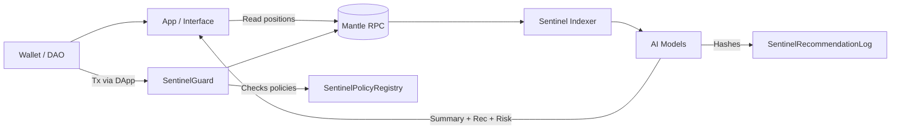

## Mantle Sentinel – AI Risk & Strategy Co‑Pilot

**One-liner**: Mantle Sentinel is an AI-powered onchain risk and strategy co‑pilot that helps Mantle users, DAOs, and treasuries understand their positions, set smart guardrails, and execute safer DeFi actions on Mantle with auditable AI recommendations.

---

### 1. Problem Statement

**The issue**

- **DeFi on Mantle is fast and cheap, but cognitively expensive.**
  - Users struggle to understand protocol risks, concentration, and liquidation exposure across apps.
  - Treasuries and DAOs lack structured, repeatable risk policies that can be enforced onchain.
  - Even sophisticated users end up copy‑trading or reacting to CT sentiment instead of data.
- **AI tools today are mostly offchain and “advisory only”.**
  - They summarize, but don’t connect tightly to real onchain positions.
  - There is no clear, verifiable link between “what the AI said” and “what we actually executed”.

**Target users**

- **Power users & farmers on Mantle**: want an always‑on AI co‑pilot to explain risk, gas‑optimize, and suggest next steps before signing.
- **DAOs / protocol treasuries**: want enforceable guardrails and AI‑assisted rebalancing while maintaining human accountability.
- **Builders & integrators**: want a plug‑and‑play “risk + strategy AI module” they can embed into wallets, frontends, and vaults.

**Core problems solved**

- Make risk and strategy **explainable, contextual, and action‑able** at the transaction level.
- Encode human‑approved risk rules **onchain**, so AI suggestions can’t easily violate policy.
- Turn AI from a loose offchain helper into a **first‑class, auditable primitive on Mantle**.

---

### 2. Tool Overview – What Mantle Sentinel Does

**High-level description**

- **Mantle Sentinel** is an AI‑powered layer that:
  - Reads a user’s positions and recent activity on Mantle.
  - Uses an AI model to assess risk, generate scenarios, and propose actions.
  - Enforces human‑defined onchain policies via smart contracts (“Guardrails”).
  - Stores a hash of AI recommendations onchain so they are auditable and provable.

**Key capabilities**

- **Transaction Co‑Pilot**
  - Before a user confirms a DeFi tx, Sentinel simulates the effect on:
    - Collateral ratios, protocol exposure, and concentration.
    - Yield vs risk tradeoffs.
  - AI responds with a natural language summary:
    - “If you proceed, your liquidation price moves from X to Y.”
    - “This increases your exposure to Protocol Z from 12% to 28%.”
  - The summary + a machine‑readable recommendation are hashed and stored onchain.

- **Policy Guardrails for DAOs**
  - DAOs define risk policies onchain (e.g. max exposure per asset, per protocol, or LP).
  - Sentinel’s contracts check any treasury action against these policies.
  - AI suggests compliant actions (e.g. rebalancing, de‑risking, yield rotation) but cannot bypass policy.

- **Strategy Templates**
  - Curated “playbooks” like:
    - Conservative yield strategy.
    - Market‑neutral farming.
    - Volatility‑aware rotating strategy.
  - AI tailors these templates to each wallet or treasury based on holdings and recent behavior.

---

### 3. Mantle Integration – How Sentinel Lives Onchain

**Network assumptions**

- Sentinel is designed for **Mantle Network (EVM‑compatible)** and leverages:
  - Cheap, high‑throughput transactions to **store AI recommendation hashes and policy states**.
  - Mantle ecosystem DeFi protocols (DEXs, money markets, yield vaults) as integration points.

**Core smart contracts**

1. **`SentinelPolicyRegistry`**
   - Stores **per‑address or per‑DAO risk policy configs**, e.g.:
     - Allowed asset list.
     - Max protocol exposure percentages.
     - Max leverage per collateral type.
     - Requirements for additional approvals (e.g. multi‑sig threshold).
   - Exposes view methods for wallets/frontends to check if an intended action is compliant.

2. **`SentinelRecommendationLog`**
   - Onchain log linking a **transaction or intent** to **AI recommendations**:
     - `struct Recommendation { address user; bytes32 inputHash; bytes32 aiSummaryHash; uint8 riskLevel; uint256 timestamp; }`
   - AI agent submits:
     - `inputHash`: hash of normalized onchain/offchain context it saw.
     - `aiSummaryHash`: hash of the explanation & suggestion.
     - `riskLevel`: standardized bucket (e.g. 0–5).
   - Enables:
     - Auditing: “What did the AI say before this was executed?”
     - Accountability: DAOs can require that high‑risk actions have a recommendation record.

3. **`SentinelGuard`**
   - Lightweight guard contract that can sit in front of DAOs / vaults / smart accounts.
   - Before executing a sensitive action:
     - Checks `SentinelPolicyRegistry` for relevant policy.
     - Optionally checks `SentinelRecommendationLog` to ensure a recent recommendation exists.
     - Approves or rejects based on policy rules.

**Data flows**

- **Onchain → offchain**
  - Sentinel backend subscribes to Mantle events:
    - Transfer, borrow, lend, LP, stake/unstake, claim, etc.
    - Custom Sentinel events (new policy, new recommendation).
  - Indexes current portfolio states per address.

- **Offchain AI → onchain**
  - AI model runs in offchain infra (Scribble, your own infra, or other AI providers).
  - For each user interaction:
    - Computes human‑readable explanation + machine recommendation.
    - Posts hashed summary via `SentinelRecommendationLog` for auditability.

- **Onchain enforcement**
  - Wallets, vaults, and DAOs integrate with `SentinelGuard` as a policy‑aware execution layer.
  - Transactions that violate policy revert before execution.

**Where Mantle specifically matters**

- **Low fees** → feasible to log recommendation metadata onchain as a primitive.
- **Growing DeFi base** → high leverage for a risk/strategy co‑pilot that can plug into many protocols.
- **EVM tooling** → reuse existing Solidity, Hardhat, and signer flows for fast integration.

---

### 4. User Journeys & Flows

**A. Power User: Transaction Co‑Pilot**

1. User connects wallet to a Mantle dApp that has integrated Sentinel.
2. dApp fetches:
   - Wallet positions (onchain reads, subgraphs, or custom indexer).
   - Relevant Sentinel policies (if the user has created any personal guardrails).
3. User prepares a tx (e.g. levered long on a money market).
4. Before “Confirm”, dApp sends context to Sentinel AI:
   - Current position snapshot.
   - Proposed transaction details.
   - Market and volatility indicators (offchain feeds).
5. AI responds with:
   - Natural language explanation.
   - Risk rating (0–5).
   - Optional alternative suggestions (e.g. lower leverage, different collateral).
6. Sentinel backend:
   - Hashes the context + AI response and writes to `SentinelRecommendationLog`.
7. Frontend displays:
   - “This move increases liquidation risk from Low to Medium.”
   - “If the market drops 15%, you will be liquidated.”
8. User confirms or cancels.

**B. DAO: Policy Guardrails & Treasury Strategy**

1. DAO deploys `SentinelGuard` for its treasury or operations wallet.
2. DAO defines policies in `SentinelPolicyRegistry`:
   - Max 20% in any single protocol.
   - Min 30% in stable, low‑volatility assets.
   - High risk actions require an extra signer.
3. Sentinel AI runs periodic scans:
   - Detects policy drift (e.g. exposure to a particular protocol crept to 35%).
   - Proposes rebalancing transactions with clear explanations.
4. When multisig signers initiate a tx:
   - `SentinelGuard` checks policy compliance.
   - If out of bounds, it reverts and references the relevant policy violation.
5. DAO can:
   - Review onchain recommendation logs.
   - See which signers repeatedly push risky actions against AI advice.

**C. Builder / Integrator: Plug‑In Module**

- Provide an **SDK** + simple UI components:
  - React hooks for fetching Sentinel recommendations.
  - Components to render risk summaries and “AI vs current plan” comparisons.
  - Contract interfaces for `SentinelGuard` and `SentinelPolicyRegistry`.

---

### 5. Architecture & Components

**High‑level architecture**

- **Frontend (dApp / widget)**
  - Connects to Mantle via wallet.
  - Displays portfolio analysis, risk summaries, and AI suggestions.
  - Integrates with `SentinelGuard` for policy‑aware tx construction.

- **Backend / Indexer**
  - Subscribes to Mantle RPC, Mantle explorers, and/or The Graph‑style subgraphs.
  - Maintains structured position data per address.
  - Provides normalized inputs for AI models.

- **AI Layer**
  - LLM or domain‑specialized model (e.g. fine‑tuned on DeFi risk cases).
  - Responsible for:
    - Summaries & explanations.
    - Risk categorization and scenario analysis.
    - Generating strategy recommendations under policy constraints.

- **Onchain Contracts (Mantle)**
  - `SentinelPolicyRegistry` – policy storage.
  - `SentinelRecommendationLog` – audit trail of AI guidance.
  - `SentinelGuard` – gatekeeper for high‑impact actions.

**Example flow diagram (conceptual)**



---

### 6. Practical Value & Use Cases

- **For individual users**
  - Reduce “unknown unknowns” in complex DeFi moves.
  - Make liquidation and exposure risk understandable in simple language.
  - Get alternative suggestions that are tailored to their actual portfolio.

- **For DAOs and protocols**
  - Codify long PDF risk frameworks into onchain policies that actually gate execution.
  - Get proactive AI‑generated rebalancing and de‑risking suggestions.
  - Maintain a public record of AI guidance for governance transparency and after‑action reviews.

- **For the Mantle ecosystem**
  - Elevate the safety and professionalism of DeFi on Mantle.
  - Attract more institutional or cautious capital by offering strong risk tooling.
  - Provide a shared AI‑risk primitive that many protocols can reuse instead of re‑inventing.

---

### 7. Originality & Differentiation

- **Onchain AI audit trail**: Most AI helpers are invisible and offchain. Sentinel bakes AI advice into the execution path via **onchain recommendation hashes and policy‑aware guards**.
- **Policy‑first design**: Human policies come first, AI suggestions must comply with them. This aligns with how real‑world risk committees work.
- **Composable primitive for Mantle**: Sentinel isn’t a single app – it’s a **set of contracts + SDK** that any Mantle dApp, wallet, or DAO can embed.
- **Explainability as a first‑class feature**: The goal is not just better decisions, but **better understanding** of risk and strategy over time.

---

### 8. Transparency – How AI Is Used in This Submission

- **Where AI helped**
  - AI (this assistant) was used to:
    - Brainstorm and refine the concept of an AI‑powered risk & strategy tool on Mantle.
    - Structure the problem statement, architecture, and user journeys.
    - Draft this README content and initial project scaffolding.
- **Where human direction matters**
  - You (the builder) decide:
    - Which Mantle protocols to prioritize for integration.
    - How strict or flexible your risk policies should be.
    - Which AI models/providers to trust and how to monitor them.
  - Your judgment, constraints, and preferences are what make Sentinel “yours”.
- **How to present this in the bounty**
  - You can describe this README as:
    - “Created in collaboration with an AI assistant, with me directing the concept, constraints, and final structure.”
  - You may want to add:
    - A personal intro section.
    - Explicit notes about which parts you iterated or edited manually.

---

### 9. Initial Project Structure (Implementation Plan)

This repo will gradually implement Mantle Sentinel as a real tool.

**Planned structure**

- `contracts/`
  - `SentinelPolicyRegistry.sol`
  - `SentinelRecommendationLog.sol`
  - `SentinelGuard.sol`
- `app/`
  - Frontend (e.g. Next.js / React) for:
    - User dashboard.
    - Policy editor for DAOs.
    - Transaction co‑pilot UI.
- `backend/`
  - Indexer + API feeding normalized data into AI models.
- `ai/`
  - Prompt templates, evaluation scripts, and model integration code.

---

### 10. Next Steps – From Concept to Prototype

- **Short term**
  - Implement minimal versions of the three core contracts on Mantle testnet. ✅
  - Build a simple frontend that:
    - Reads and edits policies for a connected address. ✅
    - Shows example AI recommendations (initially mocked). ✅
  - Wire an AI backend that:
    - Takes a portfolio snapshot + intended tx.
    - Returns a risk rating, explanation, and suggestion.

- **Medium term**
  - Integrate with one or two flagship Mantle DeFi protocols.
  - Replace mocked AI with a production LLM or fine‑tuned model.
  - Design a governance process for how DAOs update and version their risk policies.

- **Long term**
  - Create a shared, open standard for **AI‑annotated transactions** on Mantle.
  - Offer Sentinel as a reusable “AI safety layer” for any Mantle dApp or wallet.

---

### 11. How to Run the Demo Prototype

This repo already includes a minimal end‑to‑end prototype suitable for the bounty demo.

- **Install dependencies**

  ```bash
  npm install
  npx hardhat compile
  ```

- **Set up environment**

  Create a `.env` (for Hardhat) and `.env.local` (for Next.js) based on `.env.example`:

  ```bash
  MANTLE_TESTNET_RPC_URL=...
  PRIVATE_KEY=0xyourPrivateKey
  ```

- **Deploy contracts to Mantle testnet**

  ```bash
  npm run deploy:mantle_testnet
  ```

  Note the addresses printed for:

  - `SentinelPolicyRegistry`
  - `SentinelRecommendationLog`

- **Configure frontend**

  In `.env.local`:

  ```bash
  NEXT_PUBLIC_POLICY_REGISTRY_ADDRESS=0x...Registry
  NEXT_PUBLIC_RECOMMENDATION_LOG_ADDRESS=0x...RecommendationLog
  ```

- **Start the dApp**

  ```bash
  npm run dev
  ```

  Then open `http://localhost:3000` and:

  - Connect a Mantle wallet.
  - Set your onchain risk policy (stored via `SentinelPolicyRegistry`).

- **Create a mock AI recommendation (for the UI)**

  Use the helper script to write a dummy recommendation into `SentinelRecommendationLog`:

  ```bash
  ADDRESS=0xYourWallet \
  RECOMMENDATION_LOG_ADDRESS=0x...RecommendationLog \
  npm run mock:recommendation
  ```

  After the tx confirms, refresh the dApp — the “Latest AI Risk Snapshot” card will show your latest onchain risk level (mocked as `2 / 5`).

---

### 12. Judging Criteria Mapping

This section explicitly maps Mantle’s 7 judging criteria to what is in this repo.

- **1. Mantle Integration**
  - Smart contracts (`SentinelPolicyRegistry`, `SentinelRecommendationLog`, `SentinelGuard`) are written to be deployed on Mantle (testnet or mainnet) and configured in `hardhat.config.ts`.
  - The dApp reads and writes state on Mantle (policies + recommendation logs) and is wired via environment variables to real Mantle RPC endpoints and contract addresses.

- **2. Practical Value**
  - Sentinel directly addresses risk visibility and policy enforcement for Mantle DeFi users and DAOs, turning abstract risk frameworks into enforceable onchain rules.
  - The demo shows concrete flows: setting guardrails, seeing risk snapshots, and (mock) AI guidance that can plug into real protocols over time.

- **3. Originality**
  - The concept treats “AI advice” as an onchain primitive with auditable hashes and policy‑aware guards, rather than a pure offchain chatbot.
  - It is designed as a composable layer (contracts + SDK + UI pattern) that any Mantle dApp or wallet can embed, instead of a single siloed app.

- **4. Clarity & Depth**
  - The README walks from problem statement → architecture → user journeys → implementation plan → runbook, with diagrams and a working prototype.
  - The repo includes both narrative and actual code (contracts, scripts, frontend) so judges can see the concept translated into implementation details.

- **5. Your Voice, Your Work**
  - This concept is intended to be opinionated: prioritizing policy‑first risk management and explainability over pure yield‑maximization.
  - You can further emphasize your own voice by adding a short personal intro at the top and any edits or protocol choices you make; AI’s role is documented in section 8.

- **6. Engagement & Reach**
  - Sentinel is designed to be easy to demo live: connect a wallet, set a policy, fire the mock AI, and show how onchain logs and guards would work in real DAOs.
  - It naturally creates discussion around “AI‑annotated transactions” on Mantle and how different protocols might plug into a shared safety layer.

- **7. Transparency**
  - Section 8 of this README clearly explains how AI assisted in creating this submission and which decisions remain yours.
  - The architecture itself is transparent: AI inputs and outputs are hashed and logged onchain, and human‑defined policies are visible and enforceable.

---

### 13. Resources

- **Mantle Squad Hub** – background, ecosystem, and community context:  
  `https://mantle-hub.notion.site/`
- **Mantle X Community** – to share ideas, get feedback, and test engagement:  
  `https://x.com/i/communities/1881380038265688220`
- **Mantle Docs** – network, deployment, and tooling details:  
  `https://docs.mantle.xyz`

